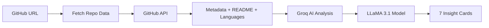

# 🔍 RepoSight

**AI-Powered Codebase Onboarding Tool**

RepoSight helps developers understand any GitHub repository in 30 seconds using AI analysis. Built with [IBM Bob IDE](https://www.ibm.com/products/watsonx-code-assistant) for the IBM Bob Hackathon 2026.


## ✨ Features

- **🎯 What It Does** - Clear explanation of the project's purpose and features
- **🛠️ Tech Stack** - Visual tags showing languages, frameworks, and tools
- **🗺️ Architecture** - Overview of how the codebase is structured
- **⚠️ Complexity Score** - 0-100 rating with visual indicator (low/medium/high)
- **📁 Key Files** - Most important files to understand first
- **👤 Developer Fit Score** - Required skills, experience level, and time to productivity
- **🚀 Getting Started** - Step-by-step setup instructions

## 🚀 Quick Start

### 1. Get Your API Key

Get a free Groq API key at [console.groq.com](https://console.groq.com)

### 2. Open the App

Simply open `index.html` in any modern web browser. No installation or build process required!

### 3. Analyze a Repository

1. Paste any GitHub repository URL (e.g., `https://github.com/facebook/react`)
2. Enter your Groq API key
3. Click "Analyze →"
4. Get instant AI-powered insights in 7 comprehensive cards

## 📋 Example Repositories to Try

- **expressjs/express** - Minimalist web framework for Node.js
- **fastapi/fastapi** - Modern Python web framework
- **facebook/react** - JavaScript library for building UIs
- **vercel/next.js** - React framework for production

## 🏗️ How It Works



### Technical Stack

- **Frontend**: Single HTML file with vanilla JavaScript
- **Styling**: Custom CSS with animated backgrounds and glass-morphism
- **AI**: Groq API with LLaMA 3.1-8b-instant model
- **Data**: GitHub REST API v3

## 🎨 Design Features

- **Animated Grid Background** - Subtle cyan grid with pulsing gradients
- **Glass-morphism Cards** - Frosted glass effect with smooth animations
- **Gradient Logo** - "Repo" in white, "Sight" with cyan-to-purple gradient
- **Responsive Layout** - Works on desktop, tablet, and mobile
- **Dark Theme** - Professional dark navy background (#0a0a0f)
- **Smooth Transitions** - All interactions have polished animations

## 🔧 Technical Details

### API Integration

**GitHub API** (No authentication required for public repos)
- `/repos/{owner}/{repo}` - Repository metadata
- `/repos/{owner}/{repo}/contents` - File structure
- `/repos/{owner}/{repo}/languages` - Language breakdown
- `/repos/{owner}/{repo}/readme` - README content

**Groq API** (OpenAI-compatible format)
- Model: `llama-3.1-8b-instant`
- Endpoint: `https://api.groq.com/openai/v1/chat/completions`
- Temperature: 0.3 (for consistent output)
- Max tokens: 1024

### Code Structure

```
index.html (900+ lines)
├── CSS Styles (500+ lines)
│   ├── Animated backgrounds
│   ├── Card layouts
│   ├── Loading states
│   └── Responsive breakpoints
└── JavaScript (400+ lines)
    ├── setExample() - Fill example repos
    ├── reset() - Clear UI state
    ├── showError() - Display errors
    ├── parseGitHubUrl() - Extract owner/repo
    ├── fetchRepoData() - Get GitHub data
    ├── analyzeWithGroq() - AI analysis
    ├── renderResults() - Display cards
    └── analyze() - Main orchestration
```

## 🎯 Use Cases

- **New Team Members** - Quickly understand a new codebase
- **Open Source Contributors** - Evaluate projects before contributing
- **Technical Interviews** - Prepare for code discussions
- **Code Reviews** - Get high-level context before diving in
- **Learning** - Explore popular repositories to learn patterns

## 🛠️ Built With IBM Bob

This project was built entirely using **IBM Bob IDE**, showcasing:

- ✅ AI-assisted code generation
- ✅ Intelligent code completion
- ✅ Automated documentation
- ✅ Best practices enforcement
- ✅ Rapid prototyping capabilities

## 📊 Performance

- **Analysis Time**: 5-10 seconds average
- **File Size**: Single 900-line HTML file (~35KB)
- **Dependencies**: Zero! Pure vanilla JavaScript
- **Browser Support**: All modern browsers (Chrome, Firefox, Safari, Edge)

## 🔒 Privacy & Security

- **No Data Storage**: All analysis happens in your browser
- **API Keys**: Stored only in memory, never persisted
- **GitHub Data**: Fetched directly from GitHub's public API
- **AI Processing**: Handled by Groq's secure infrastructure

## 🤝 Contributing

This project was created for the IBM Bob Hackathon 2026. Feel free to:

- Report bugs or issues
- Suggest new features
- Fork and customize for your needs
- Share your experience using RepoSight

## 📝 License

MIT License - feel free to use this project however you'd like!

## 🏆 IBM Bob Hackathon 2026

**Category**: Developer Tools  
**Theme**: AI-Powered Productivity  
**Built by**: [Your Name]  
**Built with**: IBM Bob IDE + Groq AI + GitHub API

---

<div align="center">

**Made with ❤️ using IBM Bob IDE**

[Try RepoSight](./index.html) | [Report Bug](https://github.com/yourusername/reposight/issues) | [Request Feature](https://github.com/yourusername/reposight/issues)

</div>